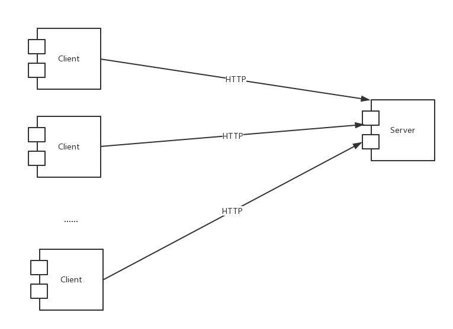

## 3. 组合视角

### 3.1 开发包图

### 3.2 运行时进程

&nbsp;&nbsp;&nbsp;&nbsp;&nbsp;&nbsp;系统包含多个客户端进程和一个服务器端进程，其进程图下图所示。结合部署图，客户端进程是在客户端浏览器上运行，服务器端进程在服务器端机器上运行。

### 3.3 物理部署

#### 3.3.1 部署地址
&nbsp;&nbsp;&nbsp;&nbsp;&nbsp;&nbsp;系统部署地址为 http://115.28.210.167

#### 3.3.2 服务器配置
&nbsp;&nbsp;&nbsp;&nbsp;&nbsp;&nbsp;SC系统部署于阿里云服务器，操作系统版本为CentOS7.2。服务器使用 `Nginx` 实现反向代理，数据库使用 `sqlite3`。

