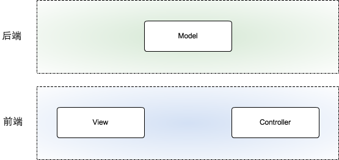
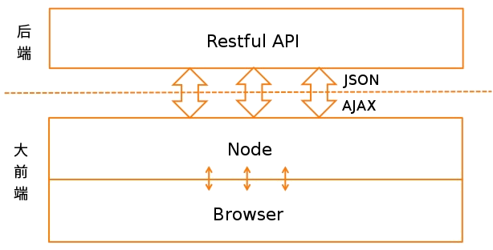
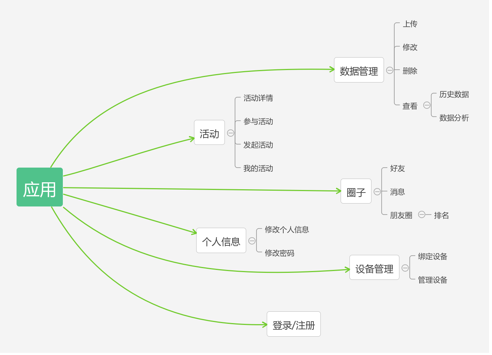

## 2. 概述

&nbsp;&nbsp;&nbsp;&nbsp;&nbsp;&nbsp;SC系统是专注于运动社交的web应用，开发的目标是为用户提供个人运动数据的管理，帮助用户更好地、更科学地运动，同时为用户提供丰富多彩的活动，使用户通过运动扩展交际圈成为可能。  
&nbsp;&nbsp;&nbsp;&nbsp;&nbsp;&nbsp;通过使用SC系统，用户可以

- 方便地管理自己的运动数据
- 科学、健康地运动
- 发起或参加相关活动
- 扩大交际圈

### 2.1 开发环境

- 前端：前端基于 `React + Redux` 框架开发，使用 `webpack` 打包应用，未实现单元测试。
- 后端：后端基于 `CodeIgniter` 框架开发，使用 `nginx` 作为反向代理服务器，`php-fpm` 处理请求。
- 开发环境：Ubuntu Kylin 16.04
- IDE：WebStorm、PhpStorm
- 测试浏览器：Chrome、android 自带浏览器

### 2.2 软件架构

* 本系统尝试在B/S架构的基础上，实现前后端分离，各层之间协作关系如下：

* 本系统使用 `React` 框架构建单页应用，后端提供符合 `Restful` 架构的 API，前后端通过 `AJAX` 交互，传输数据采用 `json` 格式，如图所示： 

### 2.3 系统设计模式

* 前端基于Redux的数据流

> 备注：初次使用 `React + Redux` 框架，对于框架的理解不够深入，此处留待补充完善。

* 本系统使用 `CodeIgniter` 框架实现后端路由控制

> 备注：本系统仅使用 `CodeIgniter` 的路由功能

### 2.4 模块结构
* 应用分为数据管理、活动、圈子、个人信息、设备管理等五个模块，示意图如下：

